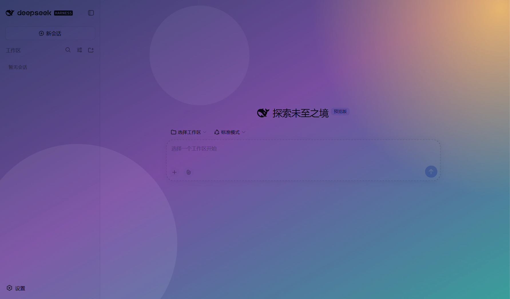
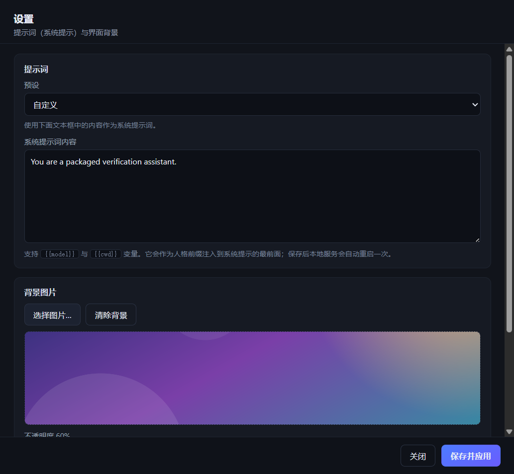

# DeepSeek Harness 独立桌面版（Windows x64）

把 [deepseek-ai/deepseek-harness](https://github.com/deepseek-ai/deepseek-harness) 打包成**点击即用、不依赖外部 Node.js、不弹命令行窗口**的独立桌面程序。

`Electron` 外壳 + 自带 `node.exe` + 自带 `@deepseek-ai/dsh` 依赖树，整包绿色可分发；目标机器无需安装 Node.js、pnpm 或任何依赖，也不需要管理员权限。

> 本项目只是**打包工程**，不修改上游任何代码。宿主使用 Harness 官方发布在 npm 上的已编译产物。

---

## 一、成品

| 文件 | 类型 | 说明 |
| --- | --- | --- |
| `dist/win-unpacked/DeepSeek Harness.exe` | 免安装（绿色版） | 双击直接运行，启动最快，推荐日常使用 |
| `dist/DeepSeek-Harness-Portable-0.1.6-x64.exe` | 单文件便携版 | 一个 exe 即可分发；首次运行需解包到临时目录，启动较慢 |
| `dist/DeepSeek-Harness-Setup-0.1.6.exe` | 安装包 | 安装到当前用户，自动创建桌面/开始菜单快捷方式 |

三种形态都**自带 Node.js 运行时**，目标机器上无需安装 Node.js、pnpm 或任何依赖，也不需要管理员权限（安装版按当前用户安装）。

## 二、运行效果

双击 exe 后会：

1. 静默启动内置的 DeepSeek Harness 本地服务（隐藏子进程，无控制台窗口、无黑框闪现）；
2. 自动读取服务输出的带令牌地址；
3. 在独立窗口中呈现 DeepSeek Harness 的完整界面。

菜单栏提供：**设置…**、在浏览器中打开、打开数据目录、重新加载、缩放、全屏、开发者工具、关于、退出。



## 三、下载与安装

### 方式 A：下载现成成品（推荐普通用户）

到本仓库的 **Releases** 页面下载，无需构建环境：

| 下载项 | 适用场景 |
| --- | --- |
| `DeepSeek-Harness-Portable-0.1.6-x64.exe` | 单文件绿色版，拷走就能跑 |
| `DeepSeek-Harness-Setup-0.1.6.exe` | 需要开始菜单/桌面快捷方式 |
| `DeepSeek-Harness-win-unpacked-0.1.6.zip` | 免安装目录版，解压即用、启动最快 |

> 由于 GitHub 单文件 100 MB 的硬限制，这些体积超过 100 MB 的成品放在 Releases 而不是仓库里；
> 仓库中的 `dist/` 保留了除这 3 个 exe 之外的全部构建产物与配置。

首次运行若出现 Windows SmartScreen「未知发布者」提示，选择**更多信息 → 仍要运行**即可（本项目未做商业代码签名）。

### 方式 B：从源码构建

构建工程在 `app/`，宿主运行时在 `runtime/`。

```powershell
cd app
$env:ELECTRON_MIRROR='https://npmmirror.com/mirrors/electron/'
$env:ELECTRON_BUILDER_BINARIES_MIRROR='https://npmmirror.com/mirrors/electron-builder-binaries/'
npm install          # 安装 electron + electron-builder（走国内镜像）

npm run dist:dir     # 免安装目录
npm run dist         # 单文件便携版
npm run dist:nsis    # 安装包
```

> 注意：electron-builder 会强制过滤掉文件映射根目录下名为 `node_modules` 的目录，
> 因此 `extraResources` 中把 `runtime/node` 与 `runtime/node_modules` 拆成两条映射分别声明。

## 四、内置新功能

### 1. 提示词设置（含默认预设）

菜单 **文件 → 设置…**（快捷键 `Ctrl+,`）打开设置窗口，第一块就是提示词：

- 下拉框提供内置默认预设：
  - 内置默认（Harness 官方人格）
  - 通用助手 / 编程助手 / 简洁模式 / 中文助手 / 翻译专家
  - 自定义
- 也可以在文本框里直接编辑；支持 `{{model}}` 与 `{{cwd}}` 变量。
- 保存后本地服务会自动重启一次，让新提示词生效。

实现方式：外壳把提示词写成一份 dsh 加载器补丁（`prompt-patch.yml`），在启动宿主时用
`dsh web --patch <补丁>` 注入，覆盖 `system-prompt` 插件的 `personaPrefix`（人格前缀）。
留空即不生成补丁，使用上游默认人格。

### 2. 背景图片

设置窗口第二块可以：

- **选择图片…**（png / jpg / jpeg / webp / gif / bmp）或**清除背景**；
- 调整**不透明度**与**模糊**；
- 选择**混合模式**：正片叠底（推荐，染色且文字清晰）、柔光、叠加、滤色、正常。

实现方式：图片由主进程用 `nativeImage` 解码、等比缩放到不超过 2560px、转成 JPEG data URL，
再作为整窗覆盖层（`mix-blend-mode`）叠加在界面之上——这样既能看清背景，又不会牺牲文字可读性。



## 五、程序结构

```
DeepSeek Harness.exe                 Electron 外壳（开窗、显示界面、设置窗口）
resources/app.asar                   外壳代码（main.js / loading.html / settings.html / settings-preload.js）
resources/runtime/node/node.exe       自带的独立 Node.js 运行时（约 89 MB）
resources/runtime/node_modules/       自带的 @deepseek-ai/dsh 及全部生产依赖（约 214 MB）
```

本仓库目录：

```
app/                 外壳源码与 electron-builder 配置（构建入口）
runtime/             宿主运行时：node/node.exe + node_modules/@deepseek-ai/dsh
dist/                构建产物：win-unpacked（可运行）+ 安装包/便携版（见 Releases）+ builder-debug.yml
docs/screenshots/    README 用的界面截图
src/                 上游 deepseek-harness 源文件快照（含 .agents 文档）
tools/               本项目自用的排查脚本（asar 解包、隐私扫描与打码）
```

设计要点：

- **完全自带运行时**：使用打包进去的 `node.exe` 与 `dsh` 依赖树，不读取系统 Node.js。
- **隐藏子进程**：`windowsHide` + 管道 stdio 启动宿主，因此不会出现命令行窗口。
- **随机端口**：默认 `--port 0`，由系统分配空闲端口，不会与其他实例抢端口。
- **不写 stdout**：GUI 进程没有控制台，所有日志写文件，避免 EPIPE 直接终止进程。
- **跨进程拼接解析**：宿主启动横幅可能被拆成多个管道块，外壳按累积内容解析地址。

## 六、数据与配置

- 用户数据沿用 Harness 默认目录 `~/.dsh`（`C:\Users\<你>\.dsh`），
  会话、设置、凭据与命令行版共享。
- 外壳设置：`%APPDATA%\DeepSeek Harness\settings.json`
- 外壳日志：`%APPDATA%\DeepSeek Harness\shell.log`
- 提示词补丁：`%APPDATA%\DeepSeek Harness\prompt-patch.yml`（由设置窗口生成）

可选命令行参数（一般不需要）：

| 参数 | 作用 |
| --- | --- |
| `--port <n>` | 指定服务端口，默认 0（自动挑选空闲端口） |
| `--home <dir>` | 指定 `DSH_HOME` 数据目录 |
| `--log <file>` | 指定外壳日志文件 |
| `--smoke` | 自检：渲染界面后截图并退出 |
| `--screenshot <file>` | 自检截图保存路径 |
| `--settings-shot <file>` | 自检时额外截取设置窗口 |

### 凭据怎么给

程序**不内置、不打包任何 API Key**。凭据按以下优先级在运行时获取：

1. 环境变量 `DEEPSEEK_API_KEY`（优先级最高，不写入磁盘）；
2. 数据目录下的 `~/.dsh/.credentials.yaml`（由 Harness 自身的引导流程写入）。

`DEEPSEEK_API_KEY` 用法示例：

```powershell
$env:DEEPSEEK_API_KEY='<你的密钥>'
.\dist\win-unpacked\'DeepSeek Harness.exe'
```

## 七、安全与隐私

发布前对全仓库做过一次逐字节审计，结论：

- **无凭据入库**：以真实密钥与其浏览器会话 secret 的字面量扫描整棵目录树（含二进制、`app.asar`、
  两个成品 exe、`runtime/`），命中数 **0**。`app.asar` 内仅 6 个外壳文件，不含任何密钥。
- **本地路径已脱敏**：`dist/builder-debug.yml` 中构建机的用户名与旧工程路径已替换为
  `<project>` / `<electron-builder-cache>` / `<temp>` 占位符；
  `docs/screenshots/02-设置窗口.png` 中泄露的本地文件路径已用背景色覆盖。
- **`.gitignore` 兜底**：`.credentials.yaml`、`.dsh/`、`settings.json`、`prompt-patch.yml`、`*.log`
  等本地状态文件已被排除，避免日后误提交。
- 仓库中出现的第三方邮箱仅来自 `dist/win-unpacked/LICENSES.chromium.html`（Chromium 与各开源库的
  许可证署名），属于必须保留的法律声明，非个人隐私。
- `dist/win-unpacked/DeepSeek Harness.exe` 启动后监听 `127.0.0.1` 随机端口并带一次性令牌；
  外壳只在该回环地址上加载界面，外部窗口一律交给系统浏览器打开。

## 八、验证记录

已用自动化自检（`--smoke`）在**打包后的成品**上验证：

```
--- shell start (packaged=true, smoke=true) ---
booting host: "...\resources\runtime\node\node.exe" "...\resources\runtime\node_modules\@deepseek-ai\dsh\lib\bin.js" web --no-open --port 0
host ready: http://127.0.0.1:<port>/?token=...
main document loaded
background applied (opacity=0.6, blur=0, blend=multiply)
SMOKE OK title="DeepSeek Harness"
```

验证过的形态：

- `dist/win-unpacked/DeepSeek Harness.exe`：界面正常渲染。
- `dist/DeepSeek-Harness-Portable-0.1.6-x64.exe`：单文件运行正常。
- 安装版安装到 `%LOCALAPPDATA%\Programs\DeepSeek Harness` 后同样正常运行，并创建了桌面与开始菜单快捷方式。

截图：`docs/screenshots/`（带背景的主界面、设置窗口、开发模式效果、打包版默认界面）。

## 九、说明

- 本构建使用 Harness 官方发布在 npm 上的**已编译产物**（`@deepseek-ai/dsh` 及其完整生产依赖树）
  作为宿主，并用 Electron 复现官方 `apps/desktop` 的“独立窗口 + 隐藏宿主进程”形态；
  未修改上游任何代码。
- 生成的 exe 未做商业代码签名，Windows SmartScreen 首次运行可能提示“未知发布者”，选择“仍要运行”即可。
- 目标平台：Windows x64。
- `src/repo/` 与 `dist/win-unpacked/resources/deepseek-harness-master/` 是上游源码快照，
  版权与许可归上游所有，详见各自的 `LICENSE` 与 `THIRD_PARTY_NOTICES.md`。
- 本仓库自身的外壳代码以 MIT 许可发布，见 [LICENSE](LICENSE)。
